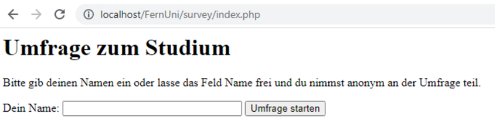
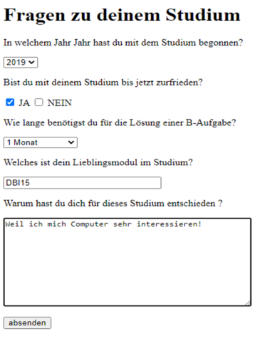
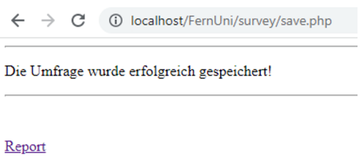
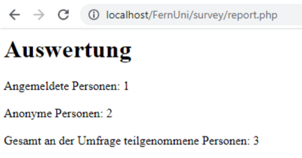
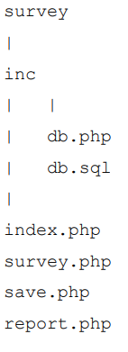

# "Kleine Umfrage" (php & MariaDB)
Einsendeaufgabencode: B-MUMB01-XX1-N01  
Bearbeiter: Maxim Heibach  
Matrikelnummer: 909442      

## Aufgabe
In der folgenden Aufgabe ist eine Umfrage mithilfe der Programmiersprache PHP und einer Relationalen Datenbank MariaDB zu erstellen.
Nutzen Sie für die Umsetzung xampp. Xampp stellt Ihnen ohne große Installationen eine Datenbank MariaDB, einen Webserver Apache und die Programmiersprache PHP zur Verfügung. Unter dem folgenden Link können Sie sich xampp kostenlos auf Ihren Rechner laden:
https://www.apachefriends.org/de/index.html

1. Legen Sie in einer MariaDB folgende Tabellen an:
   1. user_table  
– `Id` -> Primary Key und Auto Increment  
– `Name` -> Not Null

   2. survey_table
– `Id` -> Primary Key und Auto Increment  
– `UserId` (Fremdschlüssel auf die id eines Users in der user_table) -> Not Null  
– `Datum` (soll ein Datum nach dem Schema y-d-m speichern) -> Not Null  
– `Q1`(Speichert eine Antwort) -> Not Null  
– `Q2` (Speichert eine Antwort) -> Not Null  
– `Q3` (Speichert eine Antwort) -> Not Null  
– `Q4` (Speichert eine Antwort) -> Not Null  
– `Q5` (Speichert eine Antwort) -> Not Null   

   3. Füllen Sie die Tabelle `user` mit folgenden drei Datensätzen via SQL-Statement:  
– 1 Datensatz -> anonymous  
– 2 Datensatz -> Lara  
– 3 Datensatz -> Luisa

   Speichern Sie alle SQL Statements aus Aufgabe 1 i-iii in einer Datei db.sql. 

2. In dieser Aufgabe soll eine Projektstruktur und der Zugang zur Datenbank eingerichtet werden.
Erstellen Sie einen Ordner `survey` und in diesem Ordner einen Ordner `inc`. In den `inc` Ordner ist eine Datei `db.php` anzulegen. Diese Datei implementiert die Datenbankverbindungsinformationen und wird über `require(‘db.php’)` den folgenden zu erarbeiteten Daten zur Verfügung gestellt. Informationen zur Funktion `require()` finden Sie unter:
https://www.php.net/manual/de/function.require.php. 

3. Erstellen Sie im Ordner `survey` eine Datei `index.php` und eine Datei `survey.php`. Die `index.php` soll einen Nutzernamen entgegennehmen und mittels request via GET an die Datei `survey.php` übergeben. Ein leeres Feld ist ebenfalls zulässig!

    

4. Nach der Übergabe des Parameters `Name` ist zu prüfen, ob der Name bereits in der Datenbank vorhanden ist. Ist das der Fall, soll dem User eine Meldung ausgegeben werden: „Nutzer existiert schon, bitte anderen Namen wählen!“. Wird ein leerer Parameter übergeben so ist dieser als `anonymous` in der Tabelle `user_table` zu speichern. Ist der Nutzer `anonymous` bereits in der Tabelle `user_table` erfasst ist dieser **nicht** noch einmal zu speichern. Anschließend soll ein Umfrageformular dem Nutzer, wie in der folgenden Abbildung, angezeigt werden: 

    

5. Erstellen Sie im Ordner survey eine Datei `save.php`. Die Datei `save.php` nimmt die Parameter aus dem Formular der `survey.php` (siehe Aufgabe 4) via POST request entgegen und speichert diese in der Tabelle `survey_table` ab. Das aktuelle Datum ist hierbei notwendig und ist mittels einer PHP Funktion `date()` zu erzeugen. Das erfolgreiche abspeichern der Umfrage und ein Link zum Report (`report.php` -> siehe Aufgabe 6) ist dem Nutzer, wie in der folgenden Abbildung, anzuzeigen.

    

6. Erstellen Sie im Ordner survey eine Datei `report.php`. Die Datei `report.php` soll eine kleine Auswertung, wie in der folgenden Abbildung zu sehen, zu den Umfragen implementieren. Die Werte sind mittels SQL-Statements zu ermitteln.

    

Einzureichen sind die Dateien (`index.php`, `survey.php`, `save.php`, `report.php`, `db.php`, `db.sql`) in folgender Ordnerstruktur: 

